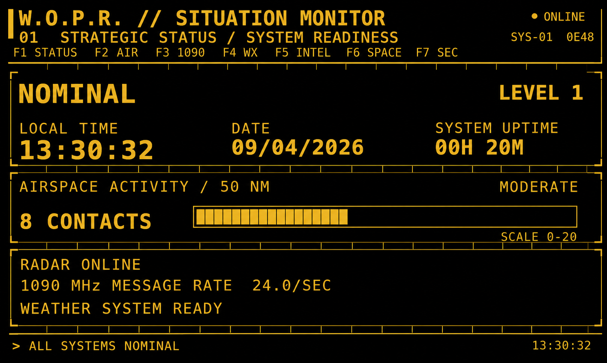
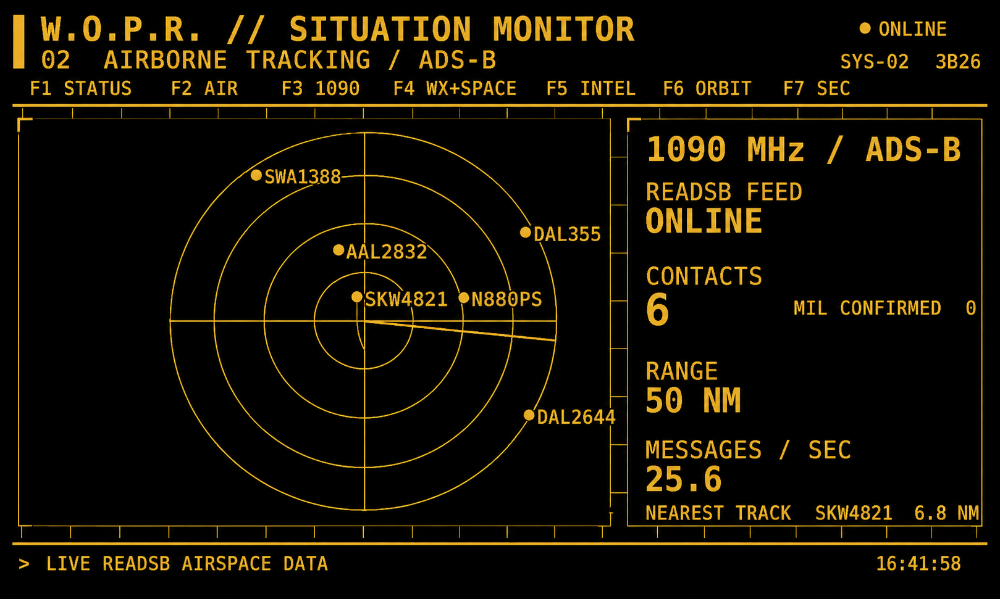
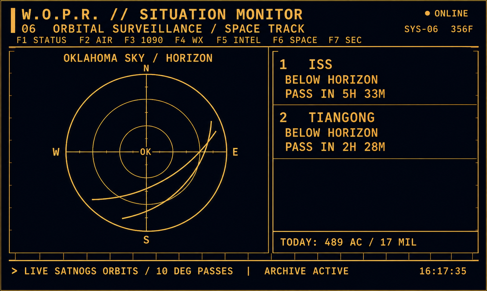

# W.O.P.R. Situation Monitor

An always-on, 800×480 Raspberry Pi information display inspired by the WOPR command center from *WarGames*. It combines a local ADS-B receiver with weather, news, markets, orbital passes, space weather, daily statistics, and SEC football in a readable amber-on-black interface.

The monitor is designed as a display piece first: large text, automatic page rotation, fullscreen operation, a hidden cursor, and graceful failure when an internet feed is unavailable.

## Preview

The following clean presentation images were reconstructed from photographs of
the working 800×480 display. They represent the real layouts and data, but are
not raw framebuffer captures.







## Screens

1. **Strategic Status** — system readiness, local time, uptime, live 50 NM aircraft count, activity level, 1090 MHz rate, and weather status.
2. **Airborne Tracking** — fixed 50 NM ADS-B radar with two-minute trails, military-aircraft recognition, contact statistics, and the nearest current track.
3. **Signal Activity** — readsb status, recently heard aircraft, message totals, and a live 60-second oscilloscope trace.
4. **Atmospheric Analysis** — current local weather, wind, humidity, pressure, visibility, sunrise/sunset, severe-alert status, Moon phase, geomagnetic Kp, and solar radio flux.
5. **Strategic Intelligence** — current U.S., technology, space, and defense headlines with DJIA, S&P 500, and NASDAQ movement.
6. **Orbital Surveillance** — an Oklahoma-centered sky plot with ISS and Tiangong pass predictions. Hubble is requested from several public sources but may be absent when none supplies usable orbital elements.
7. **Regional Conflict** — SEC football times, scores, and television coverage. This page joins automatic rotation only when relevant during football season; F7 always opens it manually.

After a complete rotation, a short WOPR pattern-analysis sequence appears before the cycle begins again.

## Requirements

- Raspberry Pi with an 800×480 display
- Python 3
- Pygame
- Skyfield
- `readsb` providing BaseStation/SBS messages on TCP port 30003
- Internet access for weather, news, markets, scores, orbital elements, and space weather

Install the Python packages supplied by Raspberry Pi OS:

```bash
sudo apt update
sudo apt install python3-pygame python3-skyfield
```

The ADS-B receiver and `readsb` must be installed and configured separately. The monitor expects it at `127.0.0.1:30003`.

## Configuration

Configuration values are near the top of `SituationMonitor_v2.py`:

```python
WIDTH, HEIGHT = 800, 480
PAGE_SECONDS = 15
READSB_HOST, READSB_PORT = "127.0.0.1", 30003
HOME_LAT, HOME_LON = 35.0000, -97.0000
LOCATION_NAME = "YOUR LOCATION"
RADAR_RANGE_NM = 50
```

Set `HOME_LAT`, `HOME_LON`, and `LOCATION_NAME` for the installation location before running the monitor.

## Running

```bash
python3 SituationMonitor_v2.py
```

The application opens fullscreen and hides the mouse cursor. Press Escape to exit during development.

## Controls

| Key | Screen |
| --- | --- |
| F1 | Strategic Status |
| F2 | Airborne Tracking |
| F3 | Signal Activity |
| F4 | Weather + Space Weather |
| F5 | Strategic Intelligence |
| F6 | Orbital Surveillance |
| F7 | SEC Football |
| F12 | Save a PNG screenshot |
| Escape | Exit |

F12 saves screenshots under:

```text
~/SituationMonitor_archive/screenshots/
```

No keyboard is required. While the desired page is visible, trigger a capture
from the laptop over SSH:

```powershell
ssh pi@PI_ADDRESS "mkdir -p ~/SituationMonitor_archive && touch ~/SituationMonitor_archive/CAPTURE_SCREENSHOT"
```

The monitor notices this harmless marker file, saves the screenshot during its
normal display loop, removes the marker, and continues running. No process
signals or kill commands are used.

To retrieve all screenshots from a laptop, run an `scp` command using the Pi's username and address. For example:

```powershell
scp "pi@PI_ADDRESS:SituationMonitor_archive/screenshots/*.png" .
```

## Data sources

The monitor uses lightweight public feeds and does not require API keys:

- Local `readsb` BaseStation/SBS stream for ADS-B
- U.S. National Weather Service for conditions, forecasts, and alerts
- NOAA Space Weather Prediction Center for Kp and solar flux
- Public RSS sources for headlines
- Yahoo Finance with a Stooq fallback for market movement
- ESPN's public scoreboard data for college football
- CelesTrak, SatNOGS, and AMSAT for orbital elements

Every network request runs outside the display loop with a timeout. Failed feeds retain previous data where possible and report an unavailable or stale state instead of stopping the interface.

## Daily archive

The program keeps compact daily ADS-B summaries in:

```text
~/SituationMonitor_archive/
```

These include unique aircraft, recognized military aircraft, peak message rate, closest contact, and total messages. Individual raw ADS-B messages are not archived.

## Privacy before publishing

Before placing this project in a public repository:

- Replace the exact home coordinates with documented example values.
- Check screenshots for reflections, names, addresses, or other personal details.
- Do not publish archive files unless their contents have been reviewed.
- Never add SSH passwords, private keys, or service credentials.

## Notes

This is intentionally a single-file application. At its present size that makes deployment and recovery straightforward. If substantially more feeds or screens are added later, the data sources and drawing code could be split into separate modules.

The interface is inspired by fictional 1980s command terminals; it is not affiliated with the creators or rights holders of *WarGames*.
